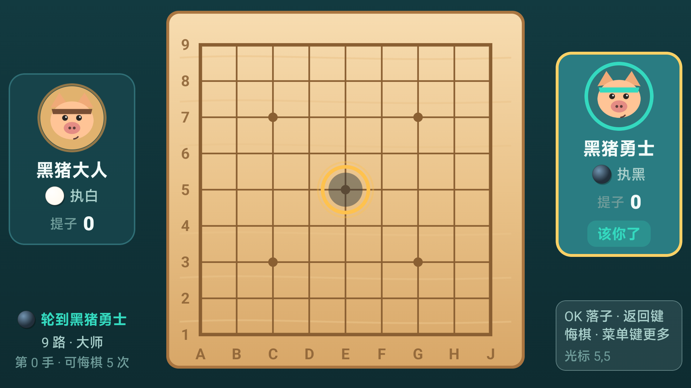

# 黑猪围棋（Heizhu Weiqi）

在小米电视上玩的围棋练习应用。**只用手里的遥控器**就能下完一整盘：方向键移光标、OK 落子、返回键悔棋、菜单键更多。

面向的场景是「孩子在电视上学会下围棋、家长陪着下」——所以难点不在界面好不好看，而在电视这个介质上：
视距 2–3 米要看得到、5 个方向键要够得到每一个选项、AI 要真的按围棋规则下而不是随机摸子。



## 功能

- **人机对局**（单机单人），**9 路 / 13 路**可选
- **五档 AI 难度**（入门 / 初级 / 中级 / 高级 / 大师）：自研 MCTS 引擎 + **端侧蒸馏小网络**
  （纯 Kotlin 手写前向，不引 ONNX/TFLite）。难度阶梯靠**每档配一个不同强弱的网络**实现
  （弱网 = 入门、最强网 = 大师），而不是让强 AI 随机放水
- MCTS 会提子、打劫、避免一线爬、填眼、能判断「没有有用的一手」并停手收工
- **完整围棋规则**：提子、打劫、禁自杀、眼、停一手、数子定胜负
- **悔棋**：菜单里直接悔，返回键悔棋会先弹确认框（防误碰把刚下的一手撤掉）
- **提子在棋盘上可见**：落子点光标环、最后一手标记、提子动画与音效
- **历史战绩**：按难度 / 时间 / 棋盘尺寸统计，含胜率与提子数
- **认输**：认输即终局，不数子（围棋里认输不结算）
- 音效与落子振动可分别开关，设置会被记住
- 全程离线，**不申请任何网络权限**

## 架构

```
core/   纯 Kotlin，无 Android 依赖。规则引擎 + MCTS AI + 端侧网络前向，可独立跑测试
bench/  纯 JVM 命令行「棋力评测台」：stdin 收局面 → stdout 回一手（JSON 行协议），
        Python 侧据此驱动本引擎与 KataGo 互殴、打分。刻意不做 GTP 协议 ——
        评测只需要「给局面、要一手」这一件事，多一套协议只会多一个与棋力无关的失败点
app/    Compose for TV 界面、本地 JSON 存档、音效
```

`core` 不依赖 Android 是刻意的：规则和 AI 的正确性靠单元测试和属性测试保证，
不需要装机就能验证——围棋逻辑出错的代价太高，不能靠"看起来下得挺像"来判断。

| 关键实现 | 位置 |
| --- | --- |
| 棋盘与合法着法（提子/打劫/自杀） | `core/.../rules/Board.kt` |
| 数子 | `core/.../rules/Scorer.kt` |
| MCTS 搜索与难度分档 | `core/.../ai/MctsEngine.kt`、`Difficulty.kt` |
| 着法评分（含位置价值、一线惩罚） | `core/.../ai/PlayoutPolicy.kt` |
| 端侧网络前向（策略 + 价值） | `core/.../ai/PolicyValueNet.kt` |
| 权重装配与缺失回退 | `app/.../data/NetAssets.kt` |
| 电视端焦点与按键处理 | `app/.../ui/components/TvComponents.kt` |
| 棋盘绘制与提子动画 | `app/.../ui/game/BoardCanvas.kt` |

## 构建

需要 **JDK 17**、**Android SDK（compileSdk 37）**、**Gradle 9.8**（AGP 9 要求 Gradle 9.x）。
本仓库不附 gradle wrapper，用本机 gradle 即可。

```bash
# local.properties 里写本机 SDK 路径
echo "sdk.dir=/path/to/Android/Sdk" > local.properties

gradle :app:assembleRelease
# 产物：app/build/outputs/apk/release/app-release.apk
```

安装到电视（电视需开启 ADB 调试）：

```bash
adb connect <电视IP>:5555
adb install -r app/build/outputs/apk/release/app-release.apk
```

APK 同时声明了普通 `LAUNCHER` 和 `LEANBACK_LAUNCHER` 两个入口——
小米电视的「应用」列表枚举的是普通 LAUNCHER，只声明 Leanback 会找不到应用。

## 测试

```bash
gradle :core:test                # 规则 + 引擎 + 网络前向：72 个用例
gradle :app:testDebugUnitTest    # 界面布局 + 焦点 + 权重装配：36 个用例（Robolectric + Compose）
```

规则部分用**朴素参考实现做差分比对**（`GoRulesConformanceTest`）：
另写一份慢但一眼能看懂对不对的围棋规则实现，随机对局中逐步比对两边的提子结果、
是否有气、终局比分。两份实现同时写错同一个地方的概率远低于一份实现悄悄写错。

界面部分（`TvScreenLayoutTest`）在无头环境渲染 9 个页面，检查有没有元素被压扁、
有没有布局重叠、每个页面能不能用方向键走到该走的地方。它抓到过真机上肉眼很难发现的
问题：历史页 5 行分组时最后一行被压成 0 像素。

## 头像：仓库里是占位图

`app/src/main/res/drawable-nodpi/avatar_*.png` 是**生成的卡通占位图**，
不是真人照片——开源仓库里不该有别人的家人照片。

想换成自己的图：把图片放到仓库外的任意目录，结构如下

```
<你的目录>/drawable-nodpi/avatar_boss.png      # 左侧，对手
<你的目录>/drawable-nodpi/avatar_warrior.png   # 右侧，自己
```

然后在 `local.properties`（该文件不进版本控制）里指向**这个目录的父目录**：

```properties
avatars.dir=/absolute/path/to/<你的目录>
```

构建时会用 buildType 的 source set 覆盖 `main`，你的图优先于仓库里的占位图；
不配置就用占位图。配错了（比如指到了 `drawable-nodpi` 本身）会在构建日志里
出声提示，而不是静默地继续用占位图。

## 已知边界

- **算力是硬约束**。网络前向跑在电视 CPU 上（纯 Kotlin 手写卷积），实测单次前向
  32×2 约 38 ms、64×4 约 236 ms、64×6 约 356 ms；13 路同一架构再慢约 2.1 倍
  （与棋盘点数成正比，169/81）。一次选点的代价是 `候选数 ×（1 + 应手数）` 次前向，
  于是每手等多久基本由网络大小与档位决定 —— 实测 9 路：入门 2.6 秒、初级 0.5 秒、
  中级 1.4 秒、高级 14.2 秒、大师 15.3 秒。「AI 最长思考」默认取**最大档 15 秒**，
  高难度档会用到接近上限（等待时界面显示「思考中…」）。
- 网络是**可选资源包**：某尺寸/档位缺权重就回退到无网络的随机 rollout 路径，
  功能降级但不崩；缺失会被记住，不会每次开局都去读一遍 assets。
- 数子采用简化的「只接触单色的空区归该色」算法，**不判死子**（盘上仍有气的死棋会算成活的），
  也不是严格的中国规则数子。正常局面偏差很小，极端局面（盘上只剩单色）会失真
  —— 认输局因此一概不数子。
- 提子动画是两段：**闪 1 秒 → 淡出 1 秒**。

## 许可证

MIT，见 [LICENSE](LICENSE)。
